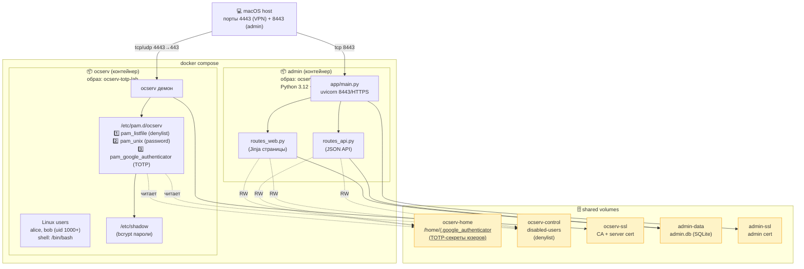
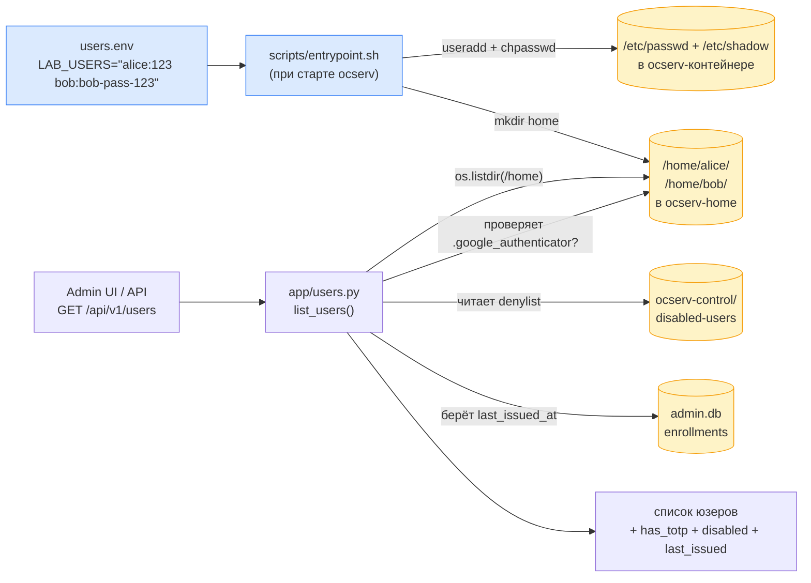
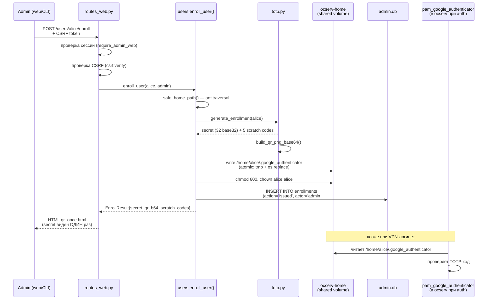
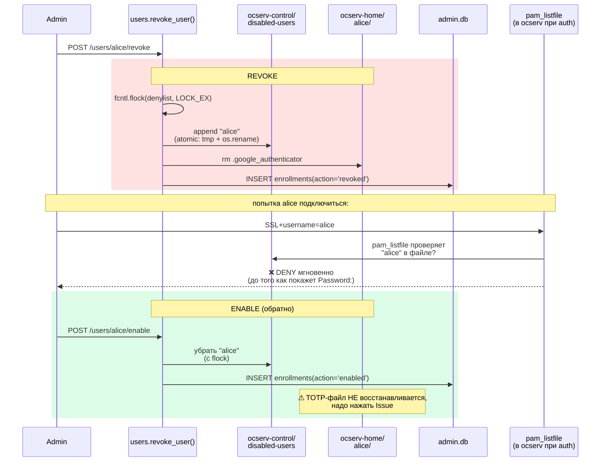
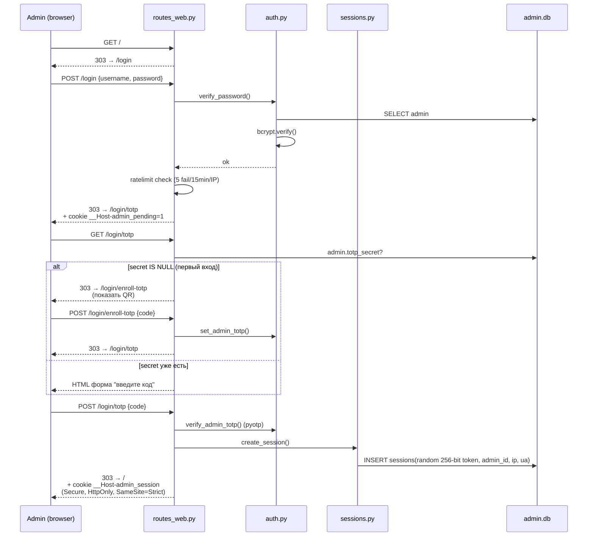

# Архитектура и потоки — ocserv-totp-lab + admin

## 1. Контейнеры, volume'ы и где что лежит

**Принцип**: admin-контейнер **не имеет** привилегий ocserv (нет CAP_NET_ADMIN, нет docker.sock). Влияет на ocserv только через **два общих файловых volume** (`ocserv-home` и `ocserv-control`).

---

## 2. Кто откуда берёт юзеров

**Ключевое**: админка **не создаёт** юзеров. Просто **читает** `/home` через shared volume. Заводятся в `users.env` + `entrypoint.sh`.

---

## 3. Поток выпуска ключа (Issue / Re-issue)

**API-эндпоинт** (`POST /api/v1/users/{u}/enroll`) идёт через ту же `users.enroll_user()` — единый источник истины. Различаются только auth (`Authorization: Bearer vpa_…` vs сессия + CSRF) и формат ответа (JSON vs HTML).

---

## 4. Поток отзыва (Revoke) и обратно (Enable)

---

## 5. Поток логина админа в саму админку

---

## 6. Куда что писать (карта модулей)

| Что | Файл | Куда пишет/читает |
|---|---|---|
| Список юзеров | `admin/app/users.py:list_users` | читает `/home/*`, `disabled-users`, `enrollments` |
| Issue TOTP | `admin/app/users.py:enroll_user` | пишет `/home/<u>/.google_authenticator`, `enrollments` |
| Revoke | `admin/app/users.py:revoke_user` | пишет `disabled-users`, удаляет TOTP-файл, `enrollments` |
| Enable | `admin/app/users.py:enable_user` | пишет `disabled-users`, `enrollments` |
| Login юзера в админку | `admin/app/auth.py` + `routes_web.py` | читает `admins`, пишет `sessions` |
| Создание API-токена | `admin/app/tokens.py:create_token` | пишет `api_tokens` (bcrypt-hash plaintext) |
| Verify API-токена | `admin/app/tokens.py:verify_token` | читает `api_tokens` |
| Любое действие | `admin/app/audit.py:write_audit` | пишет `audit_log` |
| Rate limit | `admin/app/ratelimit.py` | читает `audit_log` (sliding window) |
| TOTP файл-формат | `admin/app/totp.py` | формирует совместимое с `pam_google_authenticator` содержимое |
