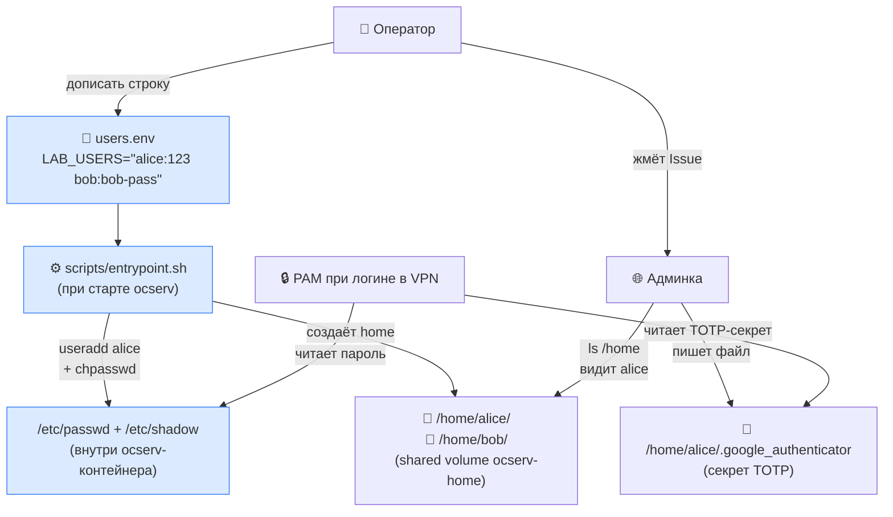
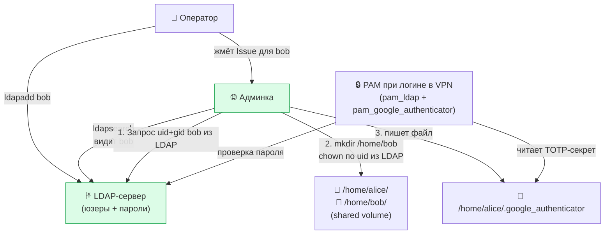
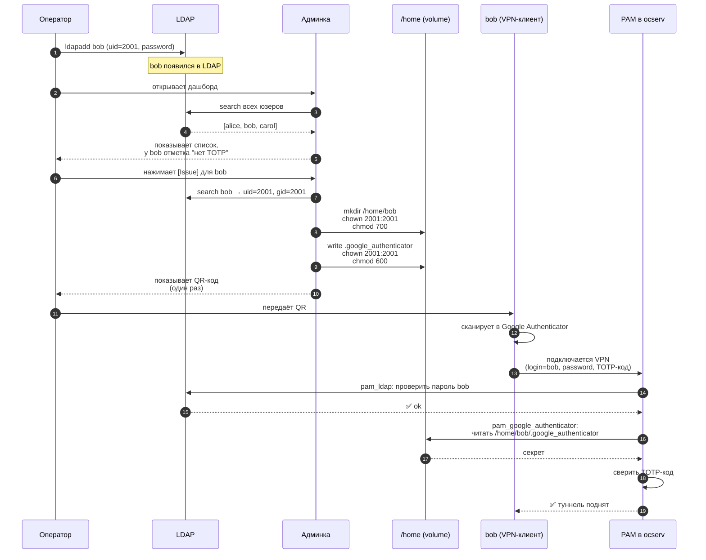

# Как заводятся юзеры и куда кладётся TOTP

## 1. Что сейчас (без LDAP)

**Простыми словами:**
1. Оператор дописывает строку в `users.env`
2. Перезапускает контейнер → `entrypoint.sh` сам делает `useradd` + создаёт папку `/home/alice/`
3. Админка видит папку → юзер появился в списке
4. Жмёшь "Issue" → файл `.google_authenticator` записывается в эту папку
5. При логине VPN: PAM читает пароль из `/etc/shadow`, TOTP-секрет из файла

---

## 2. Что станет с LDAP

**Что изменилось:**
- ❌ Нет `users.env`, нет `useradd` — юзера сразу в LDAP
- ✅ Админка вместо `ls /home` идёт в LDAP и берёт оттуда список
- ✅ При "Issue" админка **сама** создаёт папку (берёт uid/gid из LDAP) и кладёт туда TOTP-файл
- ✅ PAM меняет один модуль: `pam_unix` → `pam_ldap`. Проверка TOTP остаётся та же

**Что НЕ изменилось — куда кладётся TOTP:**
По-прежнему `/home/<user>/.google_authenticator`, тот же формат, тот же `pam_google_authenticator` для проверки. Только **папку теперь создаёт админка**, а не entrypoint при старте контейнера.

---

## 3. Один экран — пошагово для bob

---

## Главное

- **Создаёт home-папку** = админка, в момент когда жмёшь "Issue".
  Не PAM, не cron, не отдельный скрипт. Один источник истины — админка.
- **Куда положить TOTP** не меняется: тот же файл, та же папка.
- **Что меняется** только: откуда взять список юзеров (LDAP), кто создаёт home (админка), какой PAM-модуль для паролей (`pam_ldap`).
